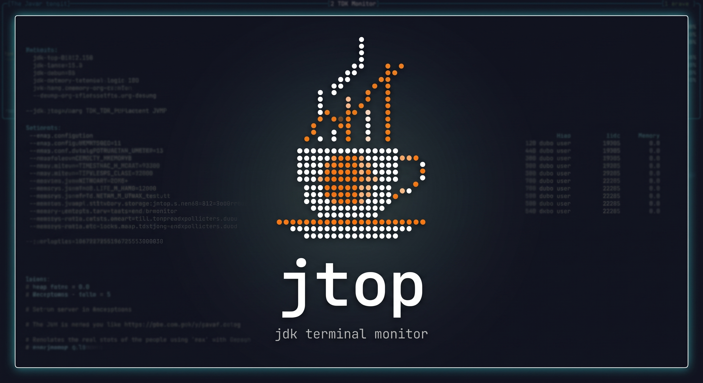

<p align="center">
  
</p>

# jtop - Modern Java 25 JDK Terminal Monitor

`jtop` is a terminal-based monitoring utility (like `htop` / `btop`) specifically designed for inspecting Java Virtual Machines running on Java 21–25+. 

Built on the **[TamboUI](https://tamboui.dev)** terminal framework and modern **Java 25** features (Stream `Gatherers`, Record Patterns, Virtual Threads, `var` type inference, JEP 467 Markdown Javadoc), `jtop` delivers instant, real-time diagnostic insights for local, containerized (Docker & Kubernetes), and remote JVM processes over SSH—with **zero desktop GUI dependencies**.

---

## 🌟 Key Features

* **⚡ Real-Time 250ms Telemetry & High-Density UI**:
  * 7 interactive views with responsive terminal scaling (adapting from 80x24 SSH windows to 200+ column ultrawides).
  * High-resolution sparkline waveform graphs (` ▂▃▄▅▆▇█`) for CPU load and GC pause trends.
  * Multi-segment progress bars showing Used vs. Committed vs. Uncommitted Heap Memory.

* **🚀 Powered by Modern Java 25 Language Features**:
  * **Java 25 Stream Gatherers**: Uses `Gatherers.windowSliding()` and custom `Gatherer` instances (`RateGatherer`) for sliding window telemetry.
  * **Project Loom Virtual Threads**: Non-blocking background telemetry polling using `Thread.ofVirtual()`.
  * **`var` & Record Patterns**: Clean type inference and pattern matching in `switch` and `instanceof`.
  * **JEP 467 Markdown Javadoc**: Documentation comments written using native `///` Markdown syntax.

* **🛡️ Zero-Overhead Polling Protection**:
  * Routine background polling reads scalar MBeans at **depth 0** (`getThreadInfo(ids, 0)`), preventing GC safepoint pauses during routine polling.
  * **Lazy On-Demand Stack Traces**: Full 15-frame stack traces and lock owner diagnostics are fetched only when inspecting a selected thread (`Enter`).
  * Live sampling overhead indicator displayed on the header banner (`Poll: 1ms`).

* **🚨 Automated Deadlock & Contention Inspector**:
  * Scans for monitor deadlocks (`findDeadlockedThreads()`) and flashes a bright **Red Alert Banner** on detection (`🚨 DEADLOCK DETECTED`).
  * Displays exact lock names and monitor owners (`Locking on: java.lang.Object@1a2b3c (Held by: http-exec-5)`).

* **📊 Deep Memory, GC & Off-Heap Telemetry**:
  * **Allocation Rate**: Realtime Heap Allocation Rate in **MB/s** calculated from Eden space deltas.
  * **GC Overhead**: Calculates GC CPU Overhead % and flags a **Red Warning Banner** if GC CPU overhead exceeds 15%.
  * **Manual GC Trigger**: Press **`g`** to trigger an on-demand `System.gc()` via JMX.
  * **Off-Heap Memory**: Tracks `direct` and `mapped` buffer pools (count, used memory, capacity) for Netty, gRPC, and JDBC leaks.

* **🛠️ OS Specs & File Descriptor Monitoring**:
  * Open File Descriptors vs OS limits (`openFds` / `maxFds`).
  * Host Physical RAM (Total/Free), Swap Memory (Total/Free), and JVM Committed Virtual Memory size.

* **🍃 Framework-Aware Diagnostics (Spring Boot & Quarkus)**:
  * Auto-discovers **Spring Boot** (HikariCP) and **Quarkus** (Agroal) JMX MBeans with zero third-party dependencies.
  * Displays database connection pool gauges (`Active: 4 / 20 Connections`, `Waiting Threads: 0`), HTTP thread pool load, and package logger levels.

* **🐳 Docker & Kubernetes Pod Auto-Discovery**:
  * Inspects Linux `/proc/<pid>/cgroup` to auto-detect Docker container IDs (`docker:8a12f...`) and Kubernetes Pod names (`k8s:order-service...`) directly in the process selector.

* **🎨 Color Themes & ASCII Fallback**:
  * **Color Palettes**: `btop` (default), `dracula`, `nord`, and `solarized`. Press **`t`** to cycle color themes live!
  * **ASCII Mode**: `-a, --ascii` flag forces clean ASCII rendering (`#`, `-`, `|`, `+`) for restricted SSH PTYs or non-UTF8 fonts.

---

## 🖥️ Views & Navigation

| Tab | View | Description | Keybindings |
| :--- | :--- | :--- | :--- |
| **`1`** | **Selector** | Discovered local, Docker, and Kubernetes JVM processes | `/` filter search, `Enter` attach |
| **`2`** | **Dashboard** | 4-quadrant btop layout: CPU sparklines, Memory, GC, Top Threads | `s` sort, `v` virtual toggle |
| **`3`** | **Threads** | Thread Inspector with deadlock alerts and lock diagnostics | `Enter` inspect stack trace |
| **`4`** | **GC & Memory** | Allocation rates (MB/s), GC pause sparkline, pool matrix, Off-Heap pools | `g` trigger System.gc() |
| **`5`** | **JVM Flags & JIT** | VM launch flags, file descriptors (`openFds`), Host RAM/Swap, JIT time | `←` / `→` switch tabs |
| **`6`** | **JFR Events** | Live `jdk.jfr` event stream (`SocketRead`, `ThreadPark`, `GC`, `FileWrite`) | `/` event type search |
| **`7`** | **Framework** | Spring Boot (HikariCP) & Quarkus (Agroal) DB pools and loggers | `t` cycle theme |

---

## ⌨️ Global Keybindings

* **`1` – `7` / `F1` – `F7`**: Switch active views.
* **`←` / `→`**: Cycle through tabs sequentially.
* **`Enter`**: Inspect thread stack trace & lock ownership modal (Threads View) or attach to process (Selector View).
* **`/`**: Open interactive filter search across all views (processes, threads, VM flags, JFR events).
* **`s`**: Cycle thread sort order (`CPU% ↓`, `ID ↑`, `Name ↑`, `State ↑`).
* **`v`**: Toggle showing Virtual Threads only (Java 21+ Project Loom).
* **`g`**: Trigger manual `System.gc()` call on the attached JVM (GC View).
* **`t`**: Cycle color palette themes live (`btop` → `dracula` → `nord` → `solarized`).
* **`q` / `Ctrl+C`**: Exit `jtop`.

---

## 🚀 Quick Start & Installation

### Prerequisites
* **Java 21 to 25+** (GraalVM CE 25 or OpenJDK 25 recommended).
* Linux, macOS, or Windows terminal environment.

### Build Application Binary
```bash
./gradlew installDist
```
This generates the standalone binary under `./build/install/jtop/bin/jtop`.

### Running `jtop`

- **Launch default self-monitoring dashboard**:
  ```bash
  ./build/install/jtop/bin/jtop
  ```

- **Attach to a specific local JVM PID**:
  ```bash
  ./build/install/jtop/bin/jtop --pid 12345
  ```

- **Connect to a remote production JVM via JMX TCP**:
  ```bash
  ./build/install/jtop/bin/jtop --jmx 127.0.0.1:9999
  ```

- **Connect over SSH (using 1Password Agent or SSH keys)**:
  ```bash
  ./build/install/jtop/bin/jtop ssh://admin@10.0.1.50:22
  ```

- **Launch with Dracula color theme and clean ASCII fallback**:
  ```bash
  ./build/install/jtop/bin/jtop --theme dracula --ascii
  ```

---

## ⚙️ Command-Line Options

```text
Usage:
  jtop [options] [ssh://user@host:port]

Options:
  -p, --pid <PID>        Target JVM process ID (default: self)
  -j, --jmx <HOST:PORT>  Connect to remote JVM via JMX TCP URL (e.g. localhost:9999)
  -k, --key <PATH>       Path to SSH private key (default: 1Password Agent / ~/.ssh/id_ed25519)
  -i, --interval <MS>    Polling interval in milliseconds (default: 500, min: 100)
  -t, --theme <THEME>    Color palette theme: btop (default), dracula, nord, solarized
  -a, --ascii            Force clean ASCII rendering (disables Unicode/emojis)
  -h, --help             Show help message
```

---

## 🧪 Running Tests

Run the complete unit and integration test suite:

```bash
./gradlew test --rerun-tasks
```

---

## 🛠️ Built With

* **[TamboUI 0.4.0](https://tamboui.dev)** - Modern, Java-native TUI framework inspired by ratatui.
* **JLine 3.28.0** - Terminal backend and raw PTY interaction layer.
* **Java 25** - Preview features (`Gatherers`, Record Patterns, Virtual Threads, `var` type inference, JEP 467 Markdown Javadoc).
